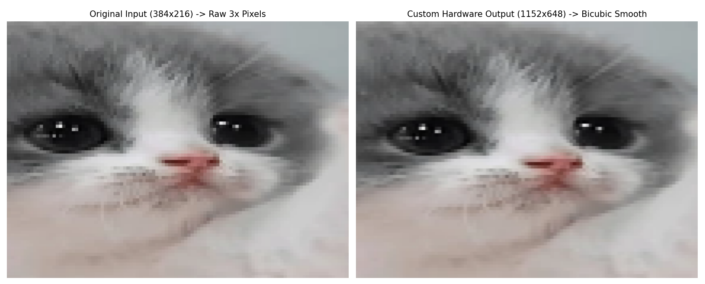

# 🚀 Hardware Acceleration of Bicubic Image Upscaling (Verilog RTL)


## 📖 Overview
In digital image processing, upscaling an image requires synthesizing new pixel values based on a discrete grid of original pixels. Standard software algorithms like Nearest-Neighbor or Bilinear interpolation are computationally cheap but introduce severe visual artifacts, such as blocky aliasing and low-pass filtering (blurring).

This project implements a high-performance **Bicubic Image Upscaler** in hardware, designed to bridge the gap between software-only complexity and real-time latency requirements. Transitioning from a Python algorithmic "golden model" to a fully synthesized **Verilog RTL pipeline**, the design evaluates a 16-pixel ($4 \times 4$) neighborhood to guarantee smooth continuity across pixel boundaries. The resulting architecture is highly optimized for FPGA and embedded vision systems, successfully eliminating jagged artifacts and preserving edge sharpness.
[report.pdf](https://github.com/user-attachments/files/25496136/report.pdf)

📄 **[Click here to read the full comprehensive Project Report (PDF)]([report.pdf](https://github.com/user-attachments/files/25496136/report.pdf))**

---

## 🖼️ Visual Verification
The design was tasked with scaling a low-resolution test image of a cat ($384 \times 216$) by a factor of 3x, yielding a target resolution of $1152 \times 648$.

**Left:** Raw 3x Nearest-Neighbor scaling (Notice the jagged diagonal lines).  
**Right:** Custom Hardware Bicubic Output (Notice the smooth curves and preserved edge sharpness in the eye reflection).

<div align="center">
  
</div>

---

## 🎥 Video Demonstration
*Watch the hardware simulation and upscaling process in action:*


https://github.com/user-attachments/assets/c4e6b6ad-60bb-4a3b-b608-8921e1c1b93e


<div align="center">
  *(If the video doesn't load directly, you can [view the raw .mp4 file here](report/demo.mp4))*
</div>

---

## ⚙️ Hardware Architecture Details
The RTL architecture relies heavily on spatial pipelining rather than temporal processing, allowing for a continuous stream of pixels to be processed every clock cycle without stalling. The 2D convolution is split into two highly efficient, separable 1D passes (Horizontal and Vertical).

* **`top_upscaler` (The Maestro)**: Manages the coordinate counters and instantiates three identical parallel cores (`core_R`, `core_G`, `core_B`) to process the 24-bit RGB channels simultaneously.
* **`line_buffer`**: In a raster-scan video stream, pixels arrive sequentially. This module utilizes deep sequential registers to store previous rows of the image, presenting four perfectly vertically aligned pixels simultaneously to the processing cores.
* **`bicubic_core`**: The computational heart of the system. It maintains a 2D Shift Register Window (a $4 \times 4$ grid of 8-bit registers) that seamlessly slides across the image data on every clock cycle.
* **`dot_product_4`**: Executes the vector arithmetic. It features four parallel hardware multipliers, specialized two's complement multiplexers to handle the negative weights inherent to the Catmull-Rom spline, and a pipelined 20-bit adder tree to guarantee absolute immunity to integer overflow.
* **`pixel_clipper`**: Because convolution weights can be negative, intermediate arithmetic can occasionally exceed the 8-bit boundary. This module safely clamps results back to the standard $0-255$ pixel range.

---

## 📊 Synthesis & Resource Utilization
The Verilog RTL was synthesized using Xilinx Vivado. The design proves remarkably efficient for a real-time DSP video pipeline, utilizing a very small footprint that leaves vast amounts of space for integration with HDMI controllers, MIPI camera interfaces, or edge-AI accelerators.

| Module Name | Description | Slice LUTs | Slice Registers |
| :--- | :--- | :---: | :---: |
| **`top_upscaler`** | **Complete System Entity** | **1,606** | **609** |
| ↳ `lb_inst` | Line Buffer (Memory) | 600 | 479 |
| ↳ `core_B` | Blue Channel DSP Core | 271 | 40 |
| ↳ `core_G` | Green Channel DSP Core | 272 | 40 |
| ↳ `core_R` | Red Channel DSP Core | 270 | 40 |
| ↳ `h_counter` | Sub-pixel Coordinate Counter| 192 | 8 |

*(Note: Assuming an entry-level FPGA target with ~63,400 LUTs, this complex upscaler utilizes only ~2.5% of the chip's logic).*

---

## 🧪 Simulation & Verification Methodology
To prevent hard-to-debug logical errors in hardware, a strict verification methodology was followed:
1. **Python Golden Model**: The algorithm was modeled structurally in Python (`python_utils/`) to validate arithmetic bounds, clipping logic, and generate expected outputs.
2. **Hex Vector Generation**: Raw hexadecimal pixel data was extracted from standard test images and compiled into `.hex` files.
3. **RTL Testbench**: The exact same hex data was streamed into the Verilog testbench (`sim/tb_upscaler.v`). Comparing the RTL output hex against the Python golden model confirmed bit-true accuracy of the hardware pipeline.

---

## 📂 Project Directory Structure
```text
📦 image-upscaler
 ┣ 📜 report.pdf        # Detailed technical paper and methodology
 ┣ 📂 python_utils/     # Python golden model, gen_coeff.py, and hex/image converters
 ┣ 📂 rtl/              # Synthesizable Verilog sources (top, buffer, core, MAC, etc.)
 ┣ 📂 sim/              # Verilog testbenches, coefficients, and hex data for Vivado
 ┣ 📂 Vivado_proj/      # Xilinx Vivado synthesis project and implementation files
 ┗ 📂 report/           # Technical documentation and media
   ┣ 🎥 demo.mp4        # Screen recording of the simulation & results
   ┗ 📂 screenshots/    # RTL schematic PDFs and the output.png visual comparison
